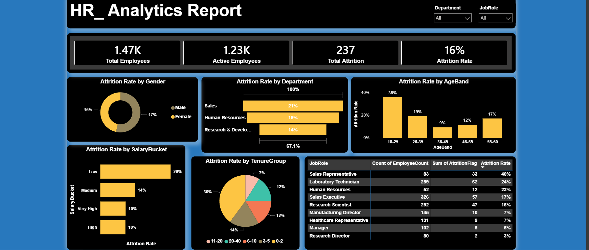

# HR_Analytics
HR Analytics Dashboard using Python, SQL and Power BI to analyze employee attrition patterns.

# HR Analytics Dashboard – Employee Attrition Analysis

## Project Overview

This project analyzes employee attrition using the IBM HR Analytics dataset. The objective is to identify factors influencing employee turnover and provide actionable insights through an interactive Power BI dashboard.

## Tools Used

* Python 
* SQL Server
* Power BI
* DAX

## Dataset

IBM HR Analytics Employee Attrition Dataset

Total Employees: 1,470

## Data Cleaning

Performed in Python using Pandas:

* Missing value check
* Duplicate check
* Outlier analysis using IQR
* Age Band creation
* Salary Bucket creation
* Tenure Group creation
* Attrition Flag generation

## SQL Analysis

Created SQL tables and performed analysis on:

* Overall Attrition Rate
* Attrition by Department
* Attrition by Job Role
* Attrition by Age Band
* Attrition by Salary Bucket
* Attrition by Tenure Group

## Power BI Dashboard

KPIs:

* Total Employees
* Active Employees
* Attrition Count
* Attrition Rate

Visuals:

* Attrition by Department
* Attrition by Age Band
* Attrition by Salary Bucket
* Attrition by Tenure Group
* Attrition by Gender
* Attrition by Job Role

## Key Insights

* Overall attrition rate: 16%
* Sales department experienced the highest attrition.
* Employees with lower income levels showed higher attrition rates.
* Most employee exits occurred within the first few years of employment.
* Certain job roles demonstrated significantly higher turnover than others.

## Repository Structure

Data/
Python/
SQL/
PowerBI

## Dashboard Preview

